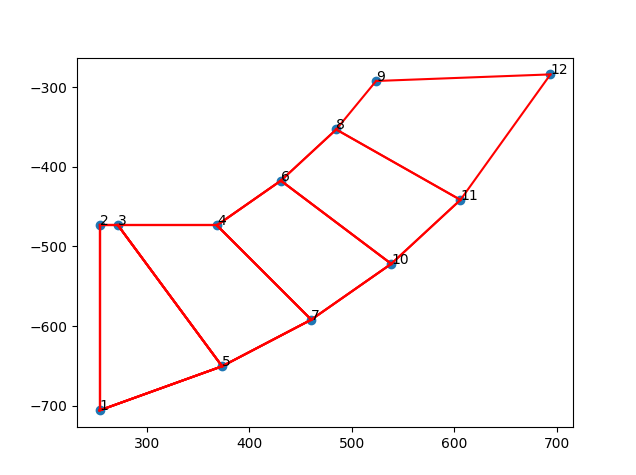
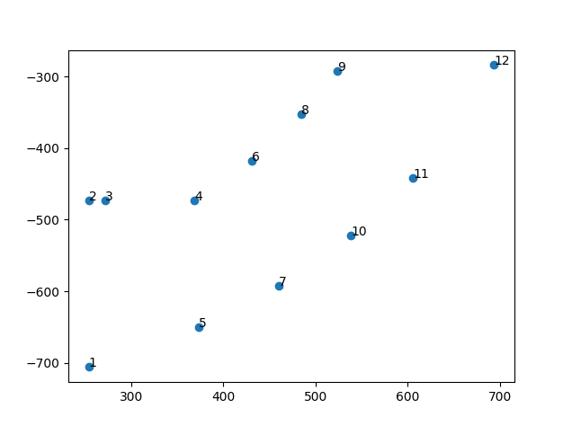

# User Manual to Create or Combine gmsh GEO Files

## 1. Introduction 

The "Create or Combine gmsh GEO Files" program allows you to combine multiple GEO files into a single GEO file or generate a GEO file from an STP file. Generation requires point cluster, which can form quadrilateral grid. Point cluster represents section shape of object to be revolved around z axis (vector: 0, 0, 1) through origin (Figure 1).



*Figure 1: Section shape with quadrilateral grid*


GEO files are commonly used in finite element analysis software for defining the geometry and mesh of a model. This program provides a graphical user interface (GUI) for easy file selection and execution of the code.


## 2. System Requirements

Python 3.x installed on your system
Required Python packages: tkinter, tkinterdnd2, PIL, networkx, matplotlib, numpy

## 3. Installation 
No installation is required for the program itself. However, ensure that you have the required Python packages installed. 
You can install the necessary packages using:

```
pip install -r requirements.txt
```

## 4. Usage To use the " Create or Combine gmsh GEO Files" program, follow these steps:

### 4.1. Launch the Program

- Open a command prompt or terminal window.
- Navigate to the directory where the program code is saved.
- Run the program by executing the command: python3 gmsh_geo_combine03.py

### 4.2. Graphical User Interface (GUI)

Once the program is launched, a GUI window will appear.

The GUI window has a drag and drop area labeled "Drag and Drop GEO Files Here".
To select the GEO files to combine, simply drag and drop the files into this area.
The names of the dropped files will be displayed in the drag and drop area.

### 4.3. Select Code Execution Option

Below the drag and drop area, there is a dropdown menu labeled "Code Execution Option" (selected by default).
This dropdown menu allows you to select the code execution option: "Combine GEO Files" or "Create GEO from STP".
- If you select "Combine GEO Files", the program will combine the dropped GEO files into a single GEO file.
- If you select "Create GEO from STP", the program will generate a single GEO file based on the dropped STP file.

### 4.4. Combine or Execute

After selecting the code execution option, click the "Combine" or "Execute" button (depending on the selected option).
- If you selected "Combine GEO Files", the program will combine the GEO files and display the path of the output file in the console.
- If you selected "Create GEO from STP", the program will ask for additional input to customize the generated GEO file.

- The program will ask you to choose the number of cluster repetitions within a full circle.
- Next, it will ask you to choose the number of consecutive cluster repetitions.
- Next, it will ask you to choose the number of consecutive empty (cluster) repetitions after drawn cluster repetitions.
- Then, it will ask you for the number of the first cluster offset within the total instances.
- The program will display the available points in groups and ask you to choose points within a 4-point sequence by entering their numbers (Figure 2).



*Figure 2: Example; Start point lower left, direction is clockwise (CW), last two points are points for next adjacent quadrilateral: 1 2 3 5. Other 3 possible directions to try in case of crossing lines: lower right, direction CCW; upper left, direction CW; upper right, direction CCW.*

Finally, the program will ask if you want to change the name of the chosen key, allowing you to enter a new name or press Enter to keep it as is.
The program will generate the GEO file accordingly and display the path of the output file in the console.


## 5. Notes

- The program assumes that the input GEO files are formatted correctly and compatible with the code logic.
- The code logic includes parsing and manipulating the input GEO files to perform the combine or execute operation.
- The program supports the combine operation for GEO files and the execute operation for STP files.
- The program utilizes various Python libraries (e.g., tkinter, networkx, matplotlib) to provide the GUI and perform the necessary operations.
- The program also includes some user prompts for additional input or settings during execution.


## 6. Limitations

- The program is specifically designed for combining GEO files and generating GEO files from STP files.
- The program may not handle certain GEO file formats or STP file complexities.
- The program allows dropping single file, not multiple files at once.
- The program has been tested only on quadrilaterals forming a sequence, complex grids may not function.
- Before combining (renumbering) multiple geo files, output geo file should be opened and exported as geo file in order to populate elements within revolving array (‘Duplicata was used’).
- The user interface and functionality of the program may be improved or expanded in future versions.


## 7. Troubleshooting

- If you encounter any issues while running the program, make sure you have the required Python packages installed.
- Check if there are any error messages displayed in the console that indicate the cause of the problem.
- Verify that the input files are in the correct format and compatible with the program's logic.


## 8. Support

For any further assistance or inquiries, please contact the program developer or refer to the program's documentation.


*Figure 3: Final result, Hexahedral mesh in combination with surface quads.*
